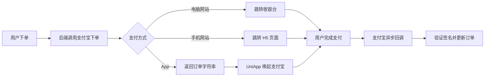
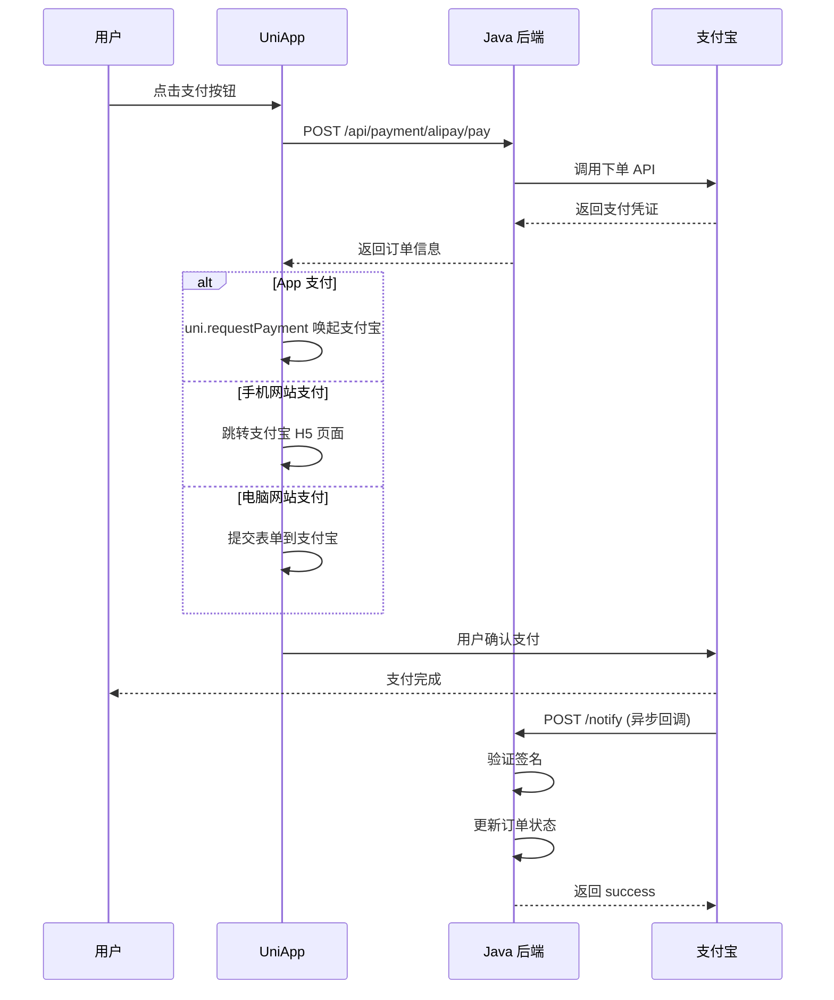
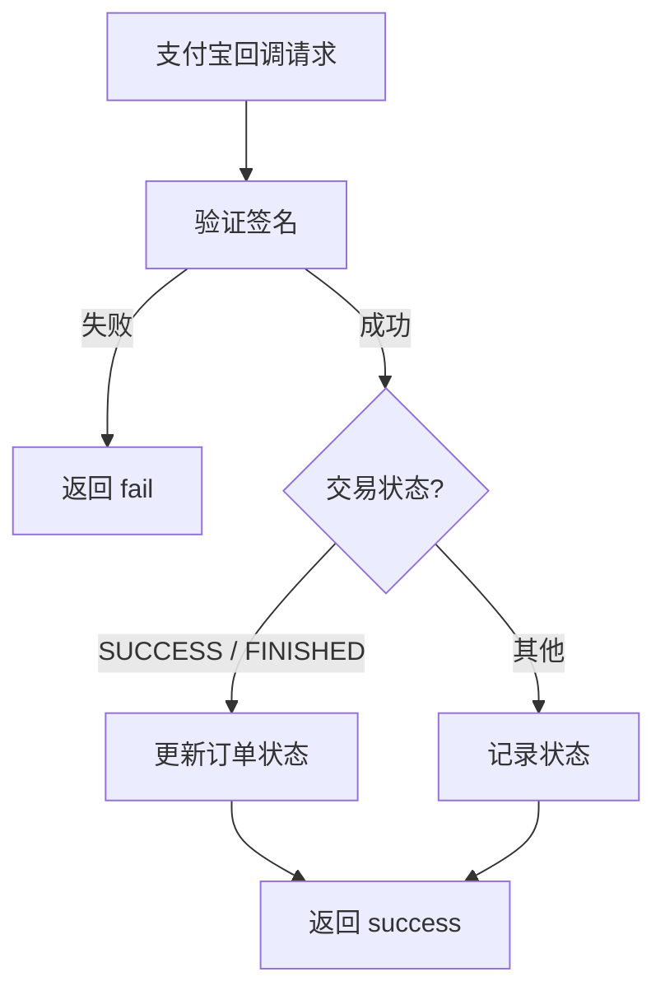

# 支付宝支付集成实战

支付宝支付是国内另一大主流支付方式。本文将基于 **Java（Spring Boot）+ UniApp** 技术栈，详细介绍支付宝支付的集成实现，包含电脑网站支付、手机网站支付、App 支付、回调处理等完整流程。

## 支付流程概览

### 整体流程图



### 支付时序图



### 支付方式对比

| 方式 | 场景 | 说明 |
|------|------|------|
| 电脑网站支付 | PC 端 | 跳转支付宝收银台 |
| 手机网站支付 | 手机浏览器 | 跳转支付宝 App 或 H5 页面 |
| App 支付 | 原生 App | 唤起支付宝 App，UniApp 适配 H5+ |
| 当面付 | 线下收款 | 扫码支付、刷脸支付 |

## 准备工作

1. 在 [支付宝开放平台](https://open.alipay.com/) 创建应用
2. 获取 AppID、应用私钥、支付宝公钥（或公钥证书）
3. 配置回调地址、签名方式（推荐 RSA2）

## Java 后端实现

### 1. 引入依赖

```xml
<!-- pom.xml -->
<dependency>
    <groupId>com.alipay.sdk</groupId>
    <artifactId>alipay-sdk-java</artifactId>
    <version>4.39.218.ALL</version>
</dependency>
```

### 2. 核心配置

```yaml
# application.yml
alipay:
  appId: 2021001234567890
  privateKey: MIIEvgIBADANBgkqhki...
  alipayPublicKey: MIIBIjANBgkqhki...
  notifyUrl: https://your-domain.com/api/payment/alipay/notify
  returnUrl: https://your-domain.com/payment/success
  gatewayUrl: https://openapi.alipay.com/gateway.do
  signType: RSA2
```

```java
// config/AlipayConfig.java
import com.alipay.api.AlipayApiException;
import com.alipay.api.AlipayClient;
import com.alipay.api.DefaultAlipayClient;
import org.springframework.beans.factory.annotation.Value;
import org.springframework.context.annotation.Bean;
import org.springframework.context.annotation.Configuration;

@Configuration
public class AlipayConfig {

    @Value("${alipay.appId}")
    private String appId;

    @Value("${alipay.privateKey}")
    private String privateKey;

    @Value("${alipay.alipayPublicKey}")
    private String alipayPublicKey;

    @Value("${alipay.gatewayUrl}")
    private String gatewayUrl;

    @Bean
    public AlipayClient alipayClient() throws AlipayApiException {
        return new DefaultAlipayClient(
            gatewayUrl,
            appId,
            privateKey,
            "json",
            "UTF-8",
            alipayPublicKey,
            "RSA2"
        );
    }
}
```

### 3. 电脑网站支付

```java
// service/AlipayService.java
import com.alipay.api.AlipayApiException;
import com.alipay.api.AlipayClient;
import com.alipay.api.DefaultAlipayClient;
import com.alipay.api.internal.util.AlipaySignature;
import com.alipay.api.request.AlipayTradePagePayRequest;
import org.springframework.beans.factory.annotation.Autowired;
import org.springframework.beans.factory.annotation.Value;
import org.springframework.stereotype.Service;

@Service
public class AlipayService {

    @Autowired
    private AlipayClient alipayClient;

    @Value("${alipay.notifyUrl}")
    private String notifyUrl;

    @Value("${alipay.returnUrl}")
    private String returnUrl;

    /**
     * 电脑网站支付
     */
    public String createPageOrder(String outTradeNo, String subject, String totalAmount) 
            throws AlipayApiException {
        AlipayTradePagePayRequest request = new AlipayTradePagePayRequest();
        request.setNotifyUrl(notifyUrl);
        request.setReturnUrl(returnUrl);

        // 设置业务参数
        String bizContent = String.format(
            "{\"out_trade_no\":\"%s\",\"total_amount\":\"%s\",\"subject\":\"%s\",\"product_code\":\"FAST_INSTANT_TRADE_PAY\"}",
            outTradeNo, totalAmount, subject
        );
        request.setBizContent(bizContent);

        // 返回表单 HTML，前端提交即可
        return alipayClient.pageExecute(request).getBody();
    }

    /**
     * 手机网站支付
     */
    public String createWapOrder(String outTradeNo, String subject, String totalAmount) 
            throws AlipayApiException {
        AlipayTradeWapPayRequest request = new AlipayTradeWapPayRequest();
        request.setNotifyUrl(notifyUrl);
        request.setReturnUrl(returnUrl);

        String bizContent = String.format(
            "{\"out_trade_no\":\"%s\",\"total_amount\":\"%s\",\"subject\":\"%s\",\"product_code\":\"QUICK_WAP_WAY\"}",
            outTradeNo, totalAmount, subject
        );
        request.setBizContent(bizContent);

        return alipayClient.pageExecute(request).getBody();
    }
}
```

### 4. App 支付

```java
/**
 * App 支付 - 返回订单字符串给 UniApp 调起
 */
public String createAppOrder(String outTradeNo, String subject, String totalAmount) 
        throws AlipayApiException {
    AlipayTradeAppPayRequest request = new AlipayTradeAppPayRequest();
    request.setNotifyUrl(notifyUrl);

    String bizContent = String.format(
        "{\"out_trade_no\":\"%s\",\"total_amount\":\"%s\",\"subject\":\"%s\"}",
        outTradeNo, totalAmount, subject
    );
    request.setBizContent(bizContent);

    return alipayClient.sdkExecute(request).getBody();
}
```

### 5. 回调处理

回调处理流程：



```java
// controller/AlipayController.java
import com.alipay.api.AlipayApiException;
import com.alipay.api.internal.util.AlipaySignature;
import org.springframework.beans.factory.annotation.Autowired;
import org.springframework.beans.factory.annotation.Value;
import org.springframework.web.bind.annotation.*;
import javax.servlet.http.HttpServletRequest;
import java.util.HashMap;
import java.util.Map;

@RestController
@RequestMapping("/api/payment/alipay")
public class AlipayController {

    @Autowired
    private AlipayService alipayService;

    @Value("${alipay.alipayPublicKey}")
    private String alipayPublicKey;

    @PostMapping("/notify")
    public String handleNotify(HttpServletRequest request) {
        try {
            // 获取回调参数
            Map<String, String> params = new HashMap<>();
            Map<String, String[]> requestParams = request.getParameterMap();
            for (String name : requestParams.keySet()) {
                String[] values = requestParams.get(name);
                StringBuilder valueStr = new StringBuilder();
                for (int i = 0; i < values.length; i++) {
                    valueStr.append(i == values.length - 1 ? values[i] : values[i] + ",");
                }
                params.put(name, valueStr.toString());
            }

            // 验证签名
            boolean signVerified = AlipaySignature.rsaCheckV1(
                params, alipayPublicKey, "UTF-8", "RSA2"
            );

            if (!signVerified) {
                return "fail";
            }

            // 验证交易状态
            String tradeStatus = params.get("trade_status");
            if ("TRADE_SUCCESS".equals(tradeStatus) || "TRADE_FINISHED".equals(tradeStatus)) {
                String outTradeNo = params.get("out_trade_no");
                orderService.updateOrderStatus(outTradeNo, "paid");
            }

            return "success";
        } catch (AlipayApiException e) {
            return "fail";
        }
    }
}
```

## UniApp 前端实现

### 1. 调起 App 支付

```javascript
// utils/alipay.js
import { request } from '@/utils/request.js'

/**
 * 发起支付宝支付（App）
 */
export async function alipayAppPay(orderId) {
  // 1. 调用后端获取支付参数
  const res = await request({
    url: '/api/payment/alipay/app-pay',
    method: 'POST',
    data: { orderId }
  })

  // 2. 调起支付宝
  // #ifdef APP-PLUS
  uni.requestPayment({
    provider: 'alipay',
    orderInfo: res.data.orderInfo, // 后端返回的订单字符串
    success: (payRes) => {
      uni.showToast({ title: '支付成功' })
      uni.navigateBack()
    },
    fail: (err) => {
      if (err.errMsg.includes('cancel')) {
        uni.showToast({ title: '已取消支付', icon: 'none' })
      } else {
        uni.showToast({ title: '支付失败', icon: 'none' })
      }
    }
  })
  // #endif
}
```

### 2. 调起手机网站支付

```javascript
// utils/alipay-h5.js
import { request } from '@/utils/request.js'

/**
 * 支付宝手机网站支付
 */
export async function alipayWapPay(orderId) {
  const res = await request({
    url: '/api/payment/alipay/wap-pay',
    method: 'POST',
    data: { orderId }
  })

  // 跳转到支付宝收银台
  // #ifdef H5
  window.location.href = res.data.payUrl
  // #endif
}
```

### 3. 调起电脑网站支付

```javascript
// utils/alipay-pc.js
import { request } from '@/utils/request.js'

/**
 * 支付宝电脑网站支付
 */
export async function alipayPagePay(orderId) {
  const res = await request({
    url: '/api/payment/alipay/page-pay',
    method: 'POST',
    data: { orderId }
  })

  // 返回表单 HTML，通过新窗口打开
  // #ifdef H5
  const newWindow = window.open('', '_blank')
  newWindow.document.write(res.data.formHtml)
  newWindow.document.forms[0].submit()
  // #endif
}
```

### 4. 在页面中使用

```vue
<template>
  <view class="pay-page">
    <view class="order-info">
      <text>订单金额：¥{{ order.amount }}</text>
    </view>
    <button class="pay-btn" @click="handleAlipayPay">支付宝支付</button>
  </view>
</template>

<script>
import { alipayAppPay } from '@/utils/alipay.js'

export default {
  data() {
    return {
      order: {}
    }
  },
  methods: {
    async handleAlipayPay() {
      try {
        await alipayAppPay(this.order.id)
      } catch (err) {
        uni.showToast({ title: '支付失败', icon: 'none' })
      }
    }
  }
}
</script>
```

## 订单查询与退款

```java
// Java 后端
@Service
public class AlipayService {

    /**
     * 查询订单
     */
    public AlipayTradeQueryResponse queryOrder(String outTradeNo) throws AlipayApiException {
        AlipayTradeQueryRequest request = new AlipayTradeQueryRequest();
        request.setBizContent(String.format("{\"out_trade_no\":\"%s\"}", outTradeNo));

        return alipayClient.execute(request);
    }

    /**
     * 退款
     */
    public AlipayTradeRefundResponse refund(String outTradeNo, String outRefundNo,
                                            String refundAmount, String refundReason) 
            throws AlipayApiException {
        AlipayTradeRefundRequest request = new AlipayTradeRefundRequest();
        String bizContent = String.format(
            "{\"out_trade_no\":\"%s\",\"out_request_no\":\"%s\",\"refund_amount\":\"%s\",\"refund_reason\":\"%s\"}",
            outTradeNo, outRefundNo, refundAmount, refundReason
        );
        request.setBizContent(bizContent);

        return alipayClient.execute(request);
    }
}
```

## 安全最佳实践

1. **签名验证** — 回调通知必须验证签名，防止伪造请求
2. **金额校验** — 回调中的金额必须与订单金额比对
3. **幂等处理** — 回调可能重复通知，用订单号做幂等
4. **证书管理** — 私钥文件不要提交到代码仓库，使用环境变量或密钥管理服务
5. **超时处理** — 支付结果查询需要轮询，设置合理的超时时间
6. **日志记录** — 记录所有支付相关请求和回调，便于排查问题

## 常见问题

### 回调收不到通知

- 检查回调地址是否可公网访问
- 确认 HTTPS 配置正确
- 检查服务器防火墙设置

### 签名验证失败

- 确认使用的是正确的签名方式（RSA2）
- 检查密钥是否匹配
- 确认字符编码为 UTF-8

### 支付金额不对

- 支付宝支付单位是**元**，不是分
- 注意浮点数精度问题，使用字符串传递金额

## 总结

支付宝支付的集成核心同样是：签名下单 → 唤起支付 → 回调通知。使用 alipay-sdk-java 可以大大简化开发工作。UniApp 通过条件编译和 `uni.requestPayment` 可以适配多种端的支付场景。在实际项目中，建议封装统一的支付接口，屏蔽不同支付平台的差异，方便后续扩展新的支付方式。
