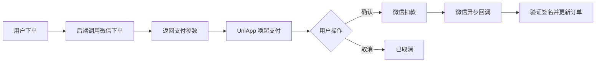
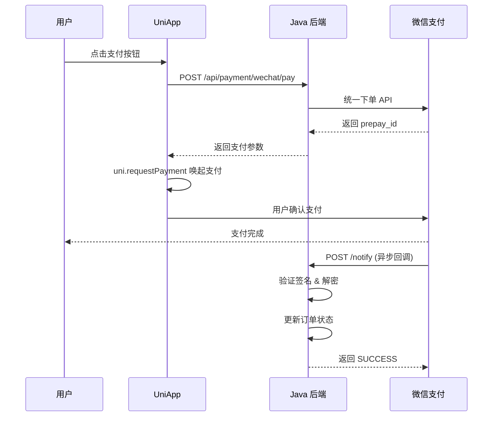
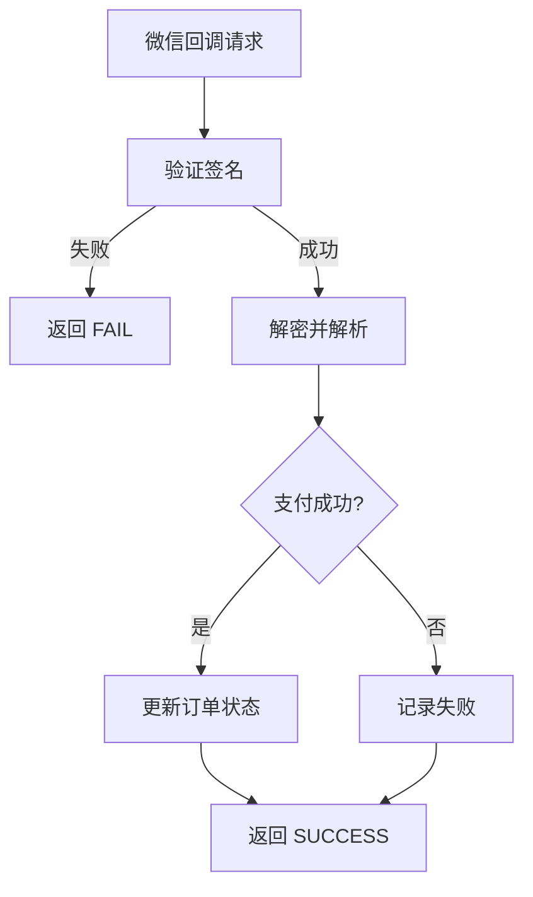

# 微信支付集成实战

微信支付是国内最常见的支付方式之一。本文将基于 **Java（Spring Boot）+ UniApp** 技术栈，详细介绍微信支付的集成实现，包含签名、下单、回调处理等完整流程。

## 支付流程概览

### 整体流程图



### 支付时序图



### 支付方式对比

| 方式 | 场景 | 说明 |
|------|------|------|
| JSAPI | 公众号/H5 | 需要 openid，适合微信内支付 |
| Native | PC 端 | 生成二维码，用户扫码支付 |
| H5 | 手机浏览器 | 跳转微信客户端完成支付 |
| App | 原生 App | 唤起微信 App 支付，UniApp 适配 H5+ |

## 准备工作

1. 在 [微信商户平台](https://pay.weixin.qq.com/) 注册商户号
2. 获取商户号（mch_id）、APIv3 密钥、商户证书
3. 下载 API 证书（apiclient_cert.p12、apiclient_key.pem、apiclient_cert.pem）

## Java 后端实现

### 1. 引入依赖

```xml
<!-- pom.xml -->
<dependency>
    <groupId>com.github.binarywang</groupId>
    <artifactId>weixin-java-pay</artifactId>
    <version>4.6.0</version>
</dependency>
```

### 2. 核心配置

```yaml
# application.yml
wechat:
  pay:
    appId: wx1234567890abcdef
    mchId: 1234567890
    apiV3Key: your-apiv3-key
    certPath: classpath:cert/apiclient_cert.p12
    keyPath: classpath:cert/apiclient_key.pem
    certPemPath: classpath:cert/apiclient_cert.pem
    notifyUrl: https://your-domain.com/api/payment/wechat/notify
```

```java
// config/WxPayConfig.java
import com.github.binarywang.wxpay.config.WxPayConfig;
import com.github.binarywang.wxpay.service.WxPayService;
import com.github.binarywang.wxpay.service.impl.WxPayServiceImpl;
import org.springframework.beans.factory.annotation.Value;
import org.springframework.context.annotation.Bean;
import org.springframework.context.annotation.Configuration;

@Configuration
public class WxPayConfig {

    @Value("${wechat.pay.appId}")
    private String appId;

    @Value("${wechat.pay.mchId}")
    private String mchId;

    @Value("${wechat.pay.apiV3Key}")
    private String apiV3Key;

    @Value("${wechat.pay.certPath}")
    private String certPath;

    @Value("${wechat.pay.keyPath}")
    private String keyPath;

    @Value("${wechat.pay.notifyUrl}")
    private String notifyUrl;

    @Bean
    public WxPayService wxPayService() {
        WxPayConfig config = new WxPayConfig();
        config.setAppId(appId);
        config.setMchId(mchId);
        config.setApiV3Key(apiV3Key);
        config.setCertPath(certPath);
        config.setKeyPath(keyPath);
        config.setNotifyUrl(notifyUrl);

        WxPayService wxPayService = new WxPayServiceImpl();
        wxPayService.setConfig(config);
        return wxPayService;
    }
}
```

### 3. 统一下单

```java
// service/WxPayService.java
import com.github.binarywang.wxpay.bean.order.WxPayNativeOrderResult;
import com.github.binarywang.wxpay.bean.order.WxPayUnifiedOrderRequest;
import com.github.binarywang.wxpay.exception.WxPayException;
import org.springframework.beans.factory.annotation.Autowired;
import org.springframework.stereotype.Service;

@Service
public class WxPayService {

    @Autowired
    private WxPayService wxPayService;

    /**
     * Native 支付 - 生成二维码
     */
    public String createNativeOrder(String outTradeNo, String description, Integer total) throws WxPayException {
        WxPayUnifiedOrderRequest request = new WxPayUnifiedOrderRequest();
        request.setOutTradeNo(outTradeNo);
        request.setDescription(description);
        request.setTotalFee(total); // 单位：分
        request.setNotifyUrl(wxPayService.getConfig().getNotifyUrl());

        WxPayNativeOrderResult result = wxPayService.unifiedOrder(request);
        return result.getCodeUrl(); // 返回二维码链接
    }

    /**
     * App 支付 - 返回唤起参数
     */
    public WxPayUnifiedOrderRequest createAppOrder(String outTradeNo, String description, Integer total) {
        WxPayUnifiedOrderRequest request = new WxPayUnifiedOrderRequest();
        request.setOutTradeNo(outTradeNo);
        request.setDescription(description);
        request.setTotalFee(total);
        request.setNotifyUrl(wxPayService.getConfig().getNotifyUrl());

        return wxPayService.createOrder(request);
    }
}
```

### 4. 回调处理

回调处理流程：



```java
// controller/WxPayController.java
import com.github.binarywang.wxpay.bean.notify.SignatureHeader;
import com.github.binarywang.wxpay.bean.notify.WxPayNotifyV3Result;
import com.github.binarywang.wxpay.exception.WxPayException;
import com.github.binarywang.wxpay.service.WxPayService;
import org.springframework.beans.factory.annotation.Autowired;
import org.springframework.web.bind.annotation.*;

@RestController
@RequestMapping("/api/payment/wechat")
public class WxPayController {

    @Autowired
    private WxPayService wxPayService;

    @PostMapping("/notify")
    public String handleNotify(@RequestHeader Map<String, String> headers,
                               @RequestBody String body) {
        try {
            // 验证签名并解密
            WxPayNotifyV3Result result = wxPayService.parseOrderNotifyV3Result(body, 
                SignatureHeader.builder()
                    .timeStamp(headers.get("wechatpay-timestamp"))
                    .nonce(headers.get("wechatpay-nonce"))
                    .signature(headers.get("wechatpay-signature"))
                    .serial(headers.get("wechatpay-serial"))
                    .build());

            // 处理支付结果
            String outTradeNo = result.getResult().getOutTradeNo();
            String tradeState = result.getResult().getTradeState();

            if ("SUCCESS".equals(tradeState)) {
                // 更新订单状态
                orderService.updateOrderStatus(outTradeNo, "paid");
            }

            return "{\"code\":\"SUCCESS\",\"message\":\"成功\"}";
        } catch (WxPayException e) {
            return "{\"code\":\"FAIL\",\"message\":\"处理失败\"}";
        }
    }
}
```

## UniApp 前端实现

### 1. 调起支付（H5+ App）

```javascript
// utils/wxpay.js
import { request } from '@/utils/request.js'

/**
 * 发起微信支付
 */
export async function wxPay(orderId) {
  // 1. 调用后端创建订单
  const res = await request({
    url: '/api/payment/wechat/pay',
    method: 'POST',
    data: { orderId }
  })

  // 2. 调起微信支付
  // #ifdef APP-PLUS
  uni.requestPayment({
    provider: 'wxpay',
    orderInfo: res.data, // 后端返回的支付参数
    success: (payRes) => {
      uni.showToast({ title: '支付成功' })
      uni.navigateBack()
    },
    fail: (err) => {
      if (err.errMsg.includes('cancel')) {
        uni.showToast({ title: '已取消支付', icon: 'none' })
      } else {
        uni.showToast({ title: '支付失败', icon: 'none' })
      }
    }
  })
  // #endif
}
```

### 2. 调起支付（微信公众号）

```javascript
// utils/wxpay-h5.js
import { request } from '@/utils/request.js'

/**
 * 微信内 H5 支付
 */
export async function wxH5Pay(orderId) {
  const res = await request({
    url: '/api/payment/wechat/h5-pay',
    method: 'POST',
    data: { orderId }
  })

  // 使用 WeixinJSBridge 调起支付
  if (typeof WeixinJSBridge !== 'undefined') {
    WeixinJSBridge.invoke('getBrandWCPayRequest', {
      appId: res.data.appId,
      timeStamp: res.data.timeStamp,
      nonceStr: res.data.nonceStr,
      package: res.data.package,
      signType: res.data.signType,
      paySign: res.data.paySign,
    }, (payRes) => {
      if (payRes.err_msg === 'get_brand_wcpay_request:ok') {
        uni.showToast({ title: '支付成功' })
        uni.navigateBack()
      } else if (payRes.err_msg.includes('cancel')) {
        uni.showToast({ title: '已取消支付', icon: 'none' })
      } else {
        uni.showToast({ title: '支付失败', icon: 'none' })
      }
    })
  }
}
```

### 3. 在页面中使用

```vue
<template>
  <view class="pay-page">
    <view class="order-info">
      <text>订单金额：¥{{ order.amount }}</text>
    </view>
    <button class="pay-btn" @click="handlePay">立即支付</button>
  </view>
</template>

<script>
import { wxPay } from '@/utils/wxpay.js'

export default {
  data() {
    return {
      order: {}
    }
  },
  methods: {
    async handlePay() {
      try {
        await wxPay(this.order.id)
      } catch (err) {
        uni.showToast({ title: '支付失败', icon: 'none' })
      }
    }
  }
}
</script>
```

## 订单查询与退款

```java
// Java 后端
@Service
public class WxPayService {

    /**
     * 查询订单
     */
    public WxPayOrderQueryResult queryOrder(String outTradeNo) throws WxPayException {
        return wxPayService.queryOrder(outTradeNo, null);
    }

    /**
     * 退款
     */
    public void refund(String outTradeNo, String outRefundNo, 
                       Integer total, Integer refund) throws WxPayException {
        WxPayRefundRequest request = new WxPayRefundRequest();
        request.setOutTradeNo(outTradeNo);
        request.setOutRefundNo(outRefundNo);
        request.setTotalFee(total);
        request.setRefundFee(refund);

        wxPayService.refund(request);
    }
}
```

## 安全最佳实践

1. **签名验证** — 回调通知必须验证签名，防止伪造请求
2. **金额校验** — 回调中的金额必须与订单金额比对
3. **幂等处理** — 回调可能重复通知，用订单号做幂等
4. **证书管理** — 私钥文件不要提交到代码仓库，使用环境变量或密钥管理服务
5. **超时处理** — 支付结果查询需要轮询，设置合理的超时时间
6. **日志记录** — 记录所有支付相关请求和回调，便于排查问题

## 常见问题

### 回调收不到通知

- 检查回调地址是否可公网访问
- 确认 HTTPS 配置正确
- 检查服务器防火墙设置

### 签名验证失败

- 确认使用的是正确的签名方式（MD5 或 RSA2）
- 检查密钥是否匹配
- 确认字符编码为 UTF-8

### 支付金额不对

- 微信支付单位是**分**，不是元
- 注意浮点数精度问题，使用整数或字符串传递金额

## 总结

微信支付的集成核心是：签名下单 → 唤起支付 → 回调通知。使用 weixin-java-pay SDK 可以大大简化开发工作。UniApp 通过条件编译和 `uni.requestPayment` 可以适配多种端的支付场景。在实际项目中，建议封装统一的支付接口，屏蔽不同支付平台的差异，方便后续扩展新的支付方式。
